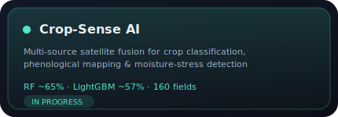
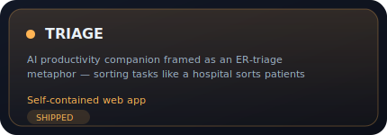

## Hi there 👋

<!--**Princy-2007-Cody/Princy-2007-Cody** is a ✨ _special_ ✨ repository because its `README.md` (this file) appears on your GitHub profile-->

Here are some ideas to get you started:

- 🔭 I’m currently working on leetcode
- 🌱 I’m currently learning WEB DEVELOPMENT / C++
- 👯 I’m looking to collaborate on GITHUB
- 🤔 I’m looking for help with ...
- 💬 Ask me about Anything you like to ask
- 📫 How to reach me: On my Instagram account
- 😄 Pronouns: He/Him
- ⚡ Fun fact: I am a Childish Gen-Z Developer

- [My profile site](https://<your-username>.github.io/github-profile/)

## 🌐 Socials:
 

# 💻 Tech Stack:
      
<!--# 📊 GitHub Stats:
 
 

---

<!-- Proudly created with GPRM ( https://gprm.itsvg.in ) -->

<!-- Proudly created with GPRM ( https://gprm.itsvg.in ) -->

<!--

 

 

### 🛰️ Active Missions

<table>
<tr>
<td width="50%">

</td>
<td width="50%">

</td>
</tr>
</table>

 

### 📡 Ground Control

 

